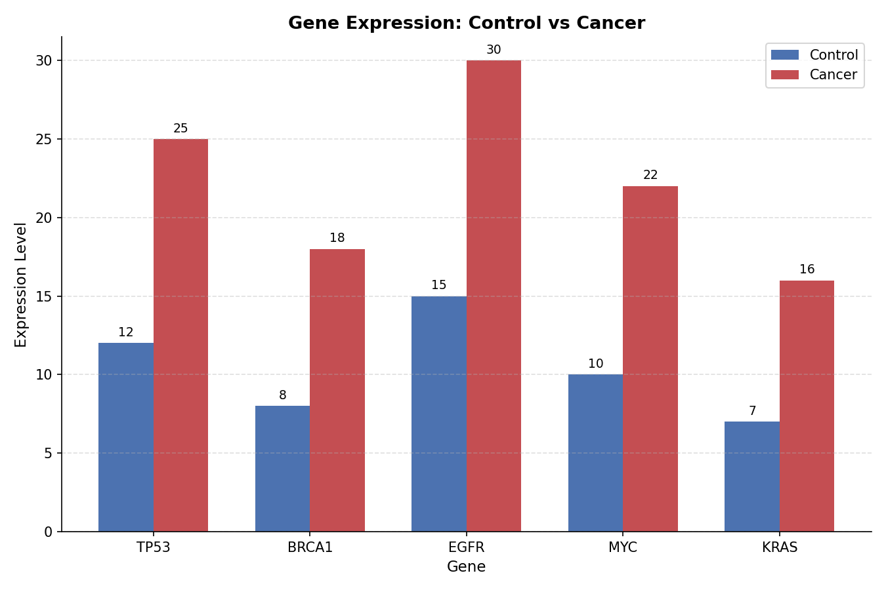

# Gene Expression Analysis: Control vs Cancer

A small Python script that analyzes fold-change in gene expression between
control and cancer samples for five well-known cancer-associated genes
(**TP53, BRCA1, EGFR, MYC, KRAS**), flags significantly upregulated genes,
and visualizes the comparison as a grouped bar chart.

## What it does

1. Loads expression values (Control vs Cancer) for each gene into a pandas DataFrame.
2. Calculates **Fold Change** = `Cancer / Control` for each gene.
3. Filters genes with **Fold Change > 1.8** as "highly expressed" (significantly upregulated in cancer).
4. Plots a grouped bar chart comparing Control vs Cancer expression per gene.

## Example Output

```
Gene Expression Data:

 Gene  Control  Cancer  Fold_Change
 TP53       12      25     2.083333
BRCA1        8      18     2.250000
 EGFR       15      30     2.000000
  MYC       10      22     2.200000
 KRAS        7      16     2.285714

Highly Expressed Genes (Fold Change > 1.8):
 Gene  Fold_Change
 TP53     2.083333
BRCA1     2.250000
 EGFR     2.000000
  MYC     2.200000
 KRAS     2.285714
```



## Tech Stack

- Python 3
- pandas
- numpy
- matplotlib

## How to Run

```bash
pip install -r requirements.txt
python gene_expression_analysis.py
```

## Project Structure

```
gene-expression-analysis/
├── gene_expression_analysis.py   # Main analysis script
├── gene_expression_plot.png      # Generated output chart
├── requirements.txt              # Dependencies
└── README.md
```

## Notes

- Dataset is a small illustrative sample (5 genes) — not real patient data.
- Fold change threshold (1.8) is adjustable via the `threshold` parameter in
  `get_high_expression_genes()`.
- Built as part of a bioinformatics portfolio exploring gene expression
  analysis workflows.
